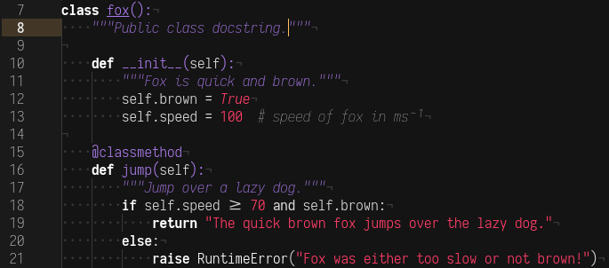

# Atom LowColor Syntax Theme (Dark)

This is a modification of Atom's dark syntax theme, primarily focusing on reducing the amount of colors used and making use of more font styles and weights. Similar to the duotone line of themes, but less colorful and more language-specific. It is currently designed with only Python in mind, however. I'd love some help with other languages, but until then this theme will mostly be focusing on Python and perhaps adding considerations for Bash, C, and HTML/CSS/JS when I learn them well.

You will want to use a font supporting multiple weights and true italics. I recommend Iosevka, but any font meeting those requirements will work.

To modify the main colors (purple and red), just change `@syntax-color-value` and `@syntax-color-function` in the `syntax-variables.less` file. There are also lines in there with alternate colors that you should uncomment if you're protanomalic or tritanomalic.

Check out styles/todo.md if you want to see what I'm planning.
